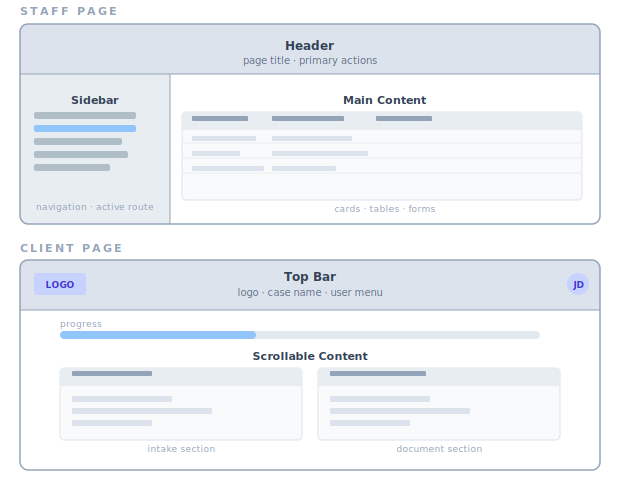

# UI Patterns & Style Guide

> **Source of truth** for all frontend visual conventions: components, layout, typography, spacing, colors, tables, forms, and responsive rules. For routes and role access see [architecture.md](architecture.md). For behavior specs see [ui-requirements.md](ui-requirements.md).

Read this before building or modifying any UI component.

## UI Tech Stack

- **Tailwind CSS 4** (utility-first, no CSS modules)
- **Lucide React** (icons)
- **CVA** (class-variance-authority) for component variants
- **`cn()` helper** from `@/lib/utils` — merges Tailwind classes safely. Use for all conditional/merged class strings.

> Full stack (React 19, Express 5, Drizzle ORM, etc.): see [architecture.md](architecture.md#tech-stack).

## Shared Components

All shared components live in `client/src/components/ui/`. **Always use these instead of writing inline equivalents.**

| Component | File | Purpose |
|---|---|---|
| `Button` | `button.tsx` | All clickable actions. Variants: default, destructive, outline, secondary, ghost, link. Sizes: default, sm, lg, icon. |
| `Input` | `input.tsx` | Text inputs. |
| `Label` | `label.tsx` | Form field labels. |
| `Select` | `select.tsx` | Dropdown selects. |
| `Card`, `CardHeader` | `card.tsx` | Bordered content panels. Default: `border rounded-lg p-4 space-y-4`. |
| `PageHeader` | `page-header.tsx` | Page title + action buttons. Use at top of every page. |
| `StatusBadge` | `status-badge.tsx` | Case status pills. Single source of truth for status-to-color mapping. |
| `EmptyState` | `empty-state.tsx` | "No data" messages. Centered, muted text, optional action link. |
| `DataTable` | `data-table.tsx` | Standard data table with header/row styling. Bordered, rounded, hover rows. |
| `ProcessingStatusBadge` | `ProcessingStatusBadge.tsx` | Document processing status (uploaded/classifying/extracting/etc). |
| `SeverityIcon`, `SeverityCard`, `ConfidenceScore` | `severity-indicator.tsx` | Error/warning/info colors for review findings, validation, confidence scores. |
| `FormField`, `YesNoField`, `TextAreaField` | `FormField.tsx` | Questionnaire form fields. |
| `DynamicTable` | `DynamicTable.tsx` | Editable data-entry tables (desktop table + mobile cards). |

### When to create a new component

Only extract a new shared component when:
1. The pattern appears in **3+ places** with the same structure, OR
2. It encodes **semantic meaning** that would be lost in raw Tailwind (e.g., `StatusBadge` encodes the status-color mapping)

Do not create components for one-off layouts.

---

## Layout Conventions

### Page container
Every page uses the same outer wrapper:
```tsx
<div className="p-6 space-y-6">
  <PageHeader title="..." actions={...} />
  {/* page content */}
</div>
```

Exceptions:
- Login pages: `flex h-screen items-center justify-center bg-background`
- Forms with narrow layout: add `max-w-lg` to the container

### Sidebar (staff)
- Fixed width: `w-64`
- Nav items: `flex items-center gap-2 px-3 py-2 rounded-md text-sm`
- Active: `bg-primary text-primary-foreground`
- Inactive: `hover:bg-muted`

### Client layout
- Top bar with logo left, user/signout right
- Content below: `flex-1 overflow-auto`

### Labeled page wireframes

Use these diagrams as a quick reference when implementing or reviewing page structure.



Common labels:
- Sidebar: route navigation (staff desktop) or drawer (mobile)
- Header/Top Bar: page identity + primary actions
- Main Content: feature-specific UI (tables, cards, forms)
- Footer area (optional): secondary actions or metadata

---

## Typography

| Purpose | Classes | Example |
|---|---|---|
| Page title (h2) | `text-2xl font-bold` | "Cases", "Settings" |
| Section header (h3) | `text-lg font-semibold` | "Cases" section in ClientDetail |
| Card header (h3) | `font-medium` | Card titles — use `CardHeader` component |
| Subsection header (h4) | `text-sm font-medium mb-2` | "Prior Addresses" inside a form section |
| Body text | `text-sm` | Table cells, descriptions |
| Secondary text | `text-sm text-muted-foreground` | Dates, helper text, metadata |
| Error text | `text-sm text-destructive` | Form validation errors |
| Link text | `text-sm font-medium text-primary hover:underline` | Clickable names in tables |

### Rules
- Never use `text-base` for UI text — use `text-sm` (14px). The only exception is mobile form inputs which use `text-base` to prevent iOS zoom.
- Never use `font-normal` explicitly — it's the default.
- Page titles are always `h2`. Never `h1` (reserved for the app logo in the layout).

---

## Spacing

| Context | Classes | Notes |
|---|---|---|
| Between page sections | `space-y-6` | Major blocks (header, filters, table) |
| Between items in a section | `space-y-4` | Form fields, card content |
| Between tightly related items | `space-y-2` | Label + input pairs |
| Horizontal button groups | `gap-3` | PageHeader actions |
| Horizontal inline items | `gap-2` | Icon + text, badge groups |
| Icon-to-text gap in buttons | `gap-1` | `<Button className="gap-1">` |
| Page padding | `p-6` | All pages |
| Card padding | `p-4` | Standard. Use `p-6` only for hero/featured cards |
| Table cell padding | `p-3` | All th/td elements |

### Rules
- Use `space-y-*` for vertical stacking. Do not use `mb-*` on individual elements unless overriding space-y in a specific child.
- Use `gap-*` for flex/grid containers. Do not mix `gap-*` and `space-y-*`.

---

## Colors

### Theme tokens (use these, not raw colors)
| Token | Usage |
|---|---|
| `text-foreground` | Primary text (default, rarely needs to be set explicitly) |
| `text-muted-foreground` | Secondary text, metadata, placeholders |
| `text-primary` | Links, active nav items |
| `text-destructive` | Error messages |
| `bg-background` | Page background |
| `bg-muted` / `bg-muted/50` | Table headers, inactive tabs, secondary backgrounds |
| `bg-primary` | Primary buttons, active nav items |
| `border` / `border-input` | Default borders |

### Status colors (case status)
Defined in `StatusBadge`. Do not hardcode these — always use the component:
| Status | Background | Text |
|---|---|---|
| intake | `bg-blue-100` | `text-blue-800` |
| documents | `bg-yellow-100` | `text-yellow-800` |
| review | `bg-purple-100` | `text-purple-800` |
| ready_to_file | `bg-green-100` | `text-green-800` |
| filed | `bg-emerald-100` | `text-emerald-800` |
| discharged | `bg-gray-100` | `text-gray-600` |
| dismissed | `bg-red-100` | `text-red-800` |
| closed | `bg-gray-100` | `text-gray-600` |

### Severity colors (validation/review)
Defined in `SeverityIcon`/`SeverityCard`. Do not hardcode — use the components:
| Severity | Background | Border | Text/Icon |
|---|---|---|---|
| error | `bg-red-50` | `border-red-200` | `text-red-600` |
| warning | `bg-amber-50` | `border-amber-200` | `text-amber-600` |
| info | `bg-blue-50` | `border-blue-200` | `text-blue-600` |

### Confidence colors
Defined in `ConfidenceScore`. Do not hardcode:
| Range | Color |
|---|---|
| >= 0.9 | `text-green-600` |
| 0.7 – 0.89 | `text-amber-600` |
| < 0.7 | `text-red-600` |

### Rules
- **Never hardcode status, severity, or confidence colors inline.** Always use the shared components. This is the single most important rule for visual consistency.
- Use theme tokens (`text-muted-foreground`, `bg-muted`) for general UI. Use raw Tailwind colors (`text-blue-500`) only for semantic indicators that are already codified in a shared component.

---

## Tables

Use `DataTable` for read-only data display (dashboards, lists). Use `DynamicTable` for editable data-entry rows (questionnaire sections).

### DataTable anatomy
```
border rounded-lg overflow-hidden        ← outer container
  bg-muted/50                            ← header row background
    text-left p-3 text-sm font-medium    ← header cells
  border-t hover:bg-muted/30             ← body rows
    p-3 text-sm                          ← body cells
```

### Rules
- Table cell padding is always `p-3`. Not `p-2`, not `p-4`.
- Header background is always `bg-muted/50`.
- Row hover is always `hover:bg-muted/30`.
- Links in table cells: `text-sm font-medium text-primary hover:underline`.

---

## Cards

Use `Card` component for all bordered panels.

```tsx
<Card>
  <CardHeader title="Section Title" />
  <p className="text-sm text-muted-foreground">Content here.</p>
</Card>
```

### Rules
- Default padding is `p-4`. Override via className only when justified.
- Clickable/interactive cards add: `hover:border-primary hover:shadow-sm transition-all cursor-pointer`.
- Do not mix card styles — if one card on a page uses `Card`, all cards on that page should too.

---

## Icons

**Library**: Lucide React. Import individual icons:
```tsx
import { Plus, ChevronLeft, Loader2 } from 'lucide-react';
```

| Context | Size classes |
|---|---|
| Inside buttons / inline with text | `h-4 w-4` |
| Badge / status indicators | `h-3.5 w-3.5` |
| Small decorative dots | `h-2.5 w-2.5` |
| Modal headers / large emphasis | `h-5 w-5` |

### Rules
- Always set both `h-*` and `w-*` (square).
- Loading spinners: use `Loader2` with `animate-spin`, never a custom spinner.
- Icon color inherits from parent text color by default. Only set explicit color for semantic indicators.

---

## Forms

### Field layout
```tsx
<div className="space-y-4">
  <div className="grid grid-cols-1 md:grid-cols-2 gap-4">
    <FormField label="First Name" path="firstName" ... />
    <FormField label="Last Name" path="lastName" ... />
  </div>
  <FormField label="Email" path="email" ... />
</div>
```

### Rules
- Use `FormField`, `YesNoField`, `TextAreaField` from the shared components. Do not write raw `<label>` + `<input>` pairs.
- 2-column grid on desktop, 1-column on mobile: `grid grid-cols-1 md:grid-cols-2 gap-4`.
- Field-to-field spacing: `gap-4` (inside grid) or `space-y-4` (stacked).
- Label-to-input spacing: `space-y-2` (handled by FormField internally).
- Conditional fields (shown on Yes/No toggle): render inline below the trigger with `mt-2`.

---

## Responsive Design

Single breakpoint: `md:` (768px).

| Pattern | Mobile (< 768px) | Desktop (>= 768px) |
|---|---|---|
| Navigation | Top bar + hamburger opens left slide-out sidebar drawer (with backdrop) | Fixed sidebar |
| Tables | Card layout (`md:hidden` / `hidden md:block`) | Standard table |
| Form grids | `grid-cols-1` | `grid-cols-2` |
| Font size in inputs | `text-base` (prevents iOS zoom) | `text-sm` via `md:text-sm` |
| Modals / overlays | Full-width bottom sheet | Centered dialog |

### Rules
- Always design mobile-first. Base classes are for mobile; `md:` classes extend for desktop.
- Tables with 4+ columns must have a mobile card variant using `DynamicTable` or a custom `md:hidden` / `hidden md:block` pair.
- Test both breakpoints. Do not ship desktop-only layouts.

---

## Interaction Patterns

### Hover states
- Table rows: `hover:bg-muted/30`
- Cards: `hover:border-primary hover:shadow-sm transition-all`
- Buttons: handled by `Button` component variants
- Links: `hover:underline`

### Focus states
- All interactive elements: `focus-visible:outline-none focus-visible:ring-1 focus-visible:ring-ring`
- Handled by `Button`, `Input`, `Select` components. Do not override.

### Loading states
- Page-level: `<p className="text-muted-foreground">Loading...</p>` inside `<div className="p-6">`
- Inline: `Loader2` icon with `animate-spin`
- Button: set `disabled` prop, text changes to "Saving..." / "Processing..."

### Empty states
- Always use `EmptyState` component
- Include an action link when there's something the user can do about it:
  ```tsx
  <EmptyState
    message="No clients yet."
    action={<Link to="/staff/clients/new" className="text-primary hover:underline">Create one</Link>}
  />
  ```

---

## Anti-Patterns (Do Not)

1. **Do not duplicate status/severity/confidence color mappings.** Use `StatusBadge`, `SeverityIcon`/`SeverityCard`, `ConfidenceScore`.
2. **Do not use `shadow-md` or `shadow-lg` on cards.** Cards use `shadow-sm` at most (only when hovered). Modals use `shadow-2xl`.
3. **Do not use `rounded-xl` or `rounded-2xl`.** Standard border radius is `rounded-lg` for containers, `rounded-md` for buttons/inputs, `rounded-full` for badges.
4. **Do not add new color tokens.** If a new semantic color is needed, add it to this doc and create a shared component.
5. **Do not use `any` in component props.** Type all props explicitly.
6. **Do not put `mb-*` on elements inside a `space-y-*` container.** The space utility handles spacing — adding margin creates inconsistent gaps.
7. **Do not build tables with `div` + flexbox.** Use `DataTable` or `<table>` with the standard class pattern.
8. **Do not use inline `style={}` attributes.** Everything goes through Tailwind classes.
